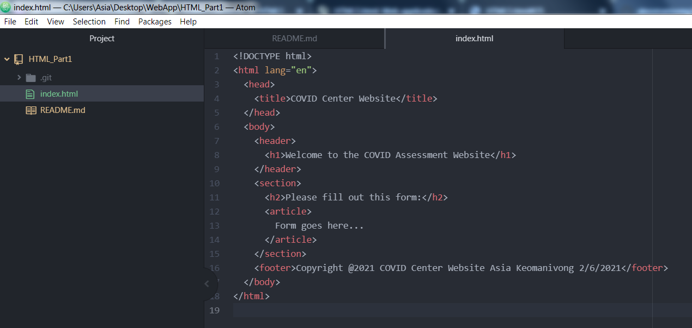
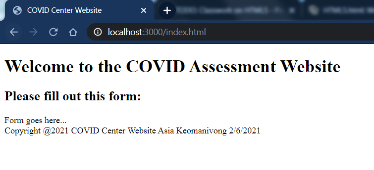

# Classwork on HTML, CSS, and JavaScript
This is my submission for TODO: Classwork on HTML Part 1 and Part 2, CSS, and JavaScript Part 2

**HTML Part 1:**

Code:

GitHub Page:

**HTMLPart 2**

**CSS and JavaScript Part 2**

Refer to the GitHub page

Click [here](https://akeomanivong.github.io/webapp_spring2021_covid_center/ "GitHubPage") for the GitHub page
